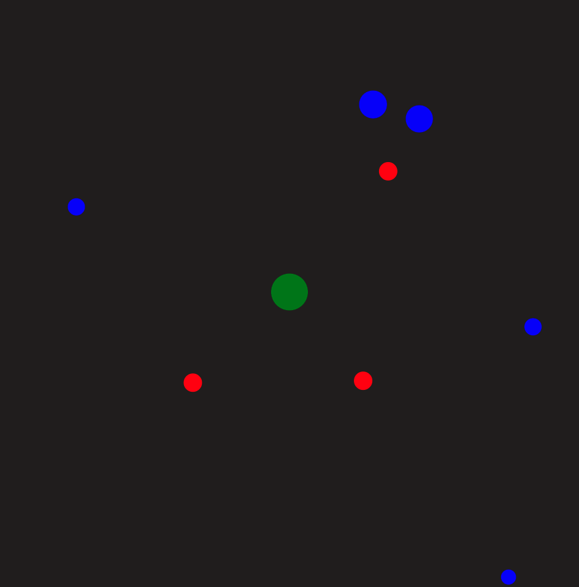
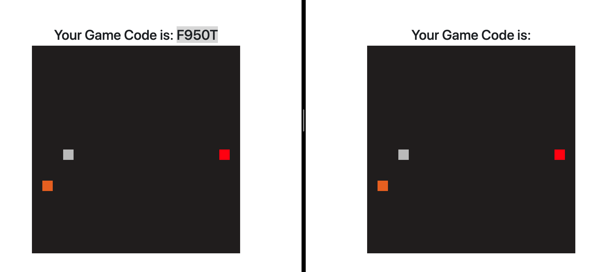

# JS fun projects

Here I have listed some of the fun projects I started building at the beginning of my learning path with JS. The games are highly commented and can be used by 
anyone else without any license. This code was written before my interview processes, which means most of the code is rushed and can be highly optimized. 

# Game Explanations

1) The first game is a centered shooting player game. The <bold>green</bold> dot in the middle of the canvas is the player, shooting <bold>red</bold> projectiles to the <bold>blue</bold> enemies. When a projectile intersects an enemy, both the projectile and the enemy are destroyed.

2) The second game is a multiplayer snake game, where player one creates a room and is given a roomId. Player two can then reference that roomId to join the first player in a battle of snakes. At the beginning both snakes are stalling, and the colors are: food=orange, playerone=gray, playertwo=red.

